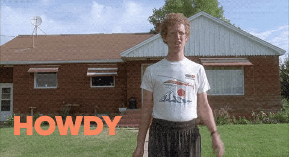

### Hello World, and welcome to my Github! 👋

I am an aerospace engineer who was ready to takeoff in 2020 ✈, however, my flight ended up being delayed by a pandemic 😷, leaving me at the gate's pre-boarding waiting room. While waiting for something to change, I discovered this amazing world of ✨**webdesign**✨, and after lots of thinking I finally decided to dive into it.

After some online courses, some self-taught concepts and lots of studying 📚 I am now starting a portifolio with the things I have coded so far. You can check them out over here! 

Also, **I am super hype about ✨UX design✨** but you won't find it over here. To learn more about my skills in that area you can contact me 😌.

If you saw something that caught your eye and you would like to give me a feedback, dont excitate to reach out!

**📫 How to reach me: gisaccaro@gmail.com**

**😄 Pronouns: she/her**

**Building knowledge in:**

